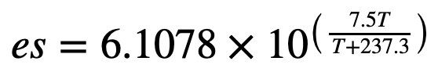
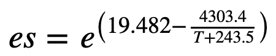

# Introduction
=> [Japanese here](https://qiita.com/Yoshiki443/items/6a4682bebdf87bd82cff).

This is a python module for calculating meteorological parameters, named **```wxparams```**, which stands for **Weather Parameters**. For instance, dew point temperature can be calculated given air temperature and relative humidity. At first I made this for my own use, but now I'd be happy to release it to the public.

- Ver1.0 : 2020/04/24 Originally released
- Ver1.1 : 2020/05/27 Added functions to convert between temperature[C] and temperature[F]
- Ver1.2 : 2020/10/03 Modified WVP_to_T function
- Ver1.3 : 2020/11/20 Added functions to calculate specific humidity, absolute humidity, and virtual temperature


# Install
You can install **wxparams** using pip as below, or just download from the [GitHub repository](https://github.com/Yoshiki443/weather_parameters).

```pip install git+https://github.com/Yoshiki443/weather_parameters```


# License
MIT license.


# Main functions
1. Wind-related functions
    - Conversion between UV components of wind and wind direction / velocity, 8 and 16 directions of wind, cross wind component, and so on
2. Moisture-related functions
    - Conversion between relative humidity and dew point temperature, saturated water vapor pressure, mixing ratio, and so on
3. Instability-related functions
    - Potential temperature, equivalent potential temperature, SSI, K-Index, and so on
4. Unit conversion
    - Conversion between **m/s** and **knot**, between **meter** and **feet**, and so on


# How to use
This is an example code.

```python
import numpy as np
import wxparams as wx
temp = np.array([[0., 5.],[10., 20.]]) # air temperature[C]
rh = np.array([[90., 50.], [70., 99.5]]) # relative humidity[%]
td = wx.RH_to_Td(temp, rh) # dew point temperature[C]
print(td)
# Output
# [[-1.44330606 -4.56523582]
#  [ 4.78251527 19.91913689]]
```

Import wxparams with a name "wx". The name "wx" is a abbreviation of "weather". Then call a function you want to use. The example above shows the case to calculate dew point temperature given air temperature and relative humidity.

The input data is supposed to be **numpy.ndarray** basically. **Pandas.Series** may be available too. As for a single value, some functions work correctly, but some not. So **numpy.ndarray** is recommended.

The followings are the explanations of each function.


## Wind-related functions

### UV_to_SpdDir(U, V)
Calculate wind velocity[m/s, kt, etc] and wind direction[degree] given U and V components of winds[m/s, kt, etc]. U component of wind means west-east wind, and V component of wind means south-north wind. Westerly wind and southerly wind usually have plus value.

All the units of wind speed are available. As for wind direction, due north wind is 360 degree. If wind velocity is 0, then wind direction is 0.

**Parameters :**

- U : array_like
  - U component of wind[m/s, kt, etc]
- V : array_like
  - V component of wind[m/s, kt, etc]

**Returns :**

- Wspd : array_like
  - Wind velocity[m/s, kt, etc]
- Wdir : array_like
  - Wind direction[degree]

---
### SpdDir_to_UV(Wspd, Wdir)
Calculate U and V components of winds[m/s, kt, etc] given wind velocity[m/s, kt, etc] and wind direction[degree].

**Parameters :**

- Wspd : array_like
  - Wind velocity[m/s, kt, etc]
- Wdir : array_like
  - Wind direction[degree]

**Returns :**

- U : array_like
  - U component of wind[m/s, kt, etc]
- V : array_like
  - V component of wind[m/s, kt, etc]

---
### Deg_to_Dir8(Wdir, dir_zero=None, numeric=False)
Convert 360-degree wind direction into 8 directions of winds, like "**N, NE, E, SE, S, SW, W, NW**". Wind direction 0 is converted to the string which is assigned to *dir_zero* option. The default is None. For instance, you can assign "VRB" to *dir_zero* like METAR, which indicates "variable wind direction".

On the other hand, if numeric is set to True, the numbers "**8, 1, 2, 3, 4, 5, 6, 7**" are output. Due north is 8, not 0. Wind direction 0 is converted to 0.

**Parameters :**

- Wdir : array_like
  - Wind direction[degree]
- dir_zero : str, optional
  - String used when wind direction is 0. Default is None
- numeric : bool, optional
  - If False, output is alphabet. It True, output is number

**Returns :**

- Dir8 : array_like
  - 8 directions of winds

---
### Deg_to_Dir16(val, dir_zero=None, numeric=False)
Convert 360-degree wind direction into 16 directions of winds, like "**N, NNE, NE, ENE, E, ESE, SE, SSE, S, SSW, SW, WSW, W, WNW, NW, NNW**". Wind direction 0 is converted to the string which is assigned to *dir_zero* option. The default is None.

On the other hand, if numeric is set to True, the numbers "**16, 1, 2, 3, 4, 5, 6, 7, 8, 9, 10, 11, 12, 13, 14, 15**" are output. Due north is 16, not 0. Wind direction 0 is converted to 0.

**Parameters :**

- Wdir : array_like
  - Wind direction[degree]
- dir_zero : str, optional
  - String used when wind direction is 0. Default is None
- numeric : bool, optional
  - If False, output is alphabet. It True, output is number


**Returns :**

- Dir16 : array_like
  - 16 directions of winds


---
### Cross_Wind(Wspd, Wdir, RWY)
Calculate cross wind component of wind given wind velocity[m/s, kt, etc], wind direction[degree], and runway direction[degree] of a airpot. The runway direction should be assigned as 360-degree, not two digits runway number.

**Parameters :**

- Wspd : array_like
  - Wind velocity[m/s, kt, ...etc]
- Wdir : array_like
  - Wind direction[degree]
- RWY : array_like
  - Runway direction[degree]

**Returns :**

- crswind : array_like
  - Cross wind component[m/s, kt, ...etc]

---
### Tail_Wind(Wspd, Wdir, RWY)
Calculate tail wind component of wind given wind velocity[m/s, kt, etc], wind direction[degree], and runway direction[degree] of a airpot. The runway direction should be assigned as 360-degree, not two digits runway number.

**Parameters :**

- Wspd : array_like
  - Wind velocity[m/s, kt, ...etc]
- Wdir : array_like
  - Wind direction[degree]
- RWY : array_like
  - Runway direction[degree]

**Returns :**

- tailwind : array_like
  - Tail wind component[m/s, kt, ...etc]

---
### Head_Wind(Wspd, Wdir, RWY)
Calculate head wind component of wind given wind velocity[m/s, kt, etc], wind direction[degree], and runway direction[degree] of a airpot. The runway direction should be assigned as 360-degree, not two digits runway number.

**Parameters :**

- Wspd : array_like
  - Wind velocity[m/s, kt, ...etc]
- Wdir : array_like
  - Wind direction[degree]
- RWY : array_like
  - Runway direction[degree]

**Returns :**

- headwind : array_like
  - Head wind component[m/s, kt, ...etc]

---
## Moisture-related functions
### RH_to_Td(T, RH, formula="Bolton")
Calculate dew point temperature[C] given air temperature[C] and relative humidity[%]. Relative humidity is automatically clipped minimum 0.1% since 0% is not available.

In this function, saturated water vapor pressure[hPa] is also calculated. There are 3 formulas to calculate it. Default is "Bolton", but "Tetens" and "WMO" are also available. See T_to_WVP for the detail.

**Parameters :**

- T : array_like
  - Air temperature[C]
- RH : array_like
  - Relative humidity[%]
- formula : str, optional (default="Bolton")
  - Select a formula to calculate saturated water vapor pressure[hPa]. "Bolton" is default, and "Tetens" and "WMO" are also available.

**Returns :**

- Td : array_like
  - Dew point temperature[C]

---
### Td_to_RH(T, Td, formula="Bolton")
Calculate relative humidity[%] given air temperature[C] and dew point temperature[C].

In this function, saturated water vapor pressure[hPa] is also calculated. There are 3 formulas to calculate it. Default is "Bolton", but "Tetens" and "WMO" are also available. See T_to_WVP for the detail.

**Parameters :**

- T : array_like
  - Air temperature[C]
- Td : array_like
  - Dew point temperature[C]
- formula : str, optional (default="Bolton")
  - Select a formula to calculate saturated water vapor pressure[hPa]. "Bolton" is default, and "Tetens" and "WMO" are also available.

**Returns :**

- RH : array_like
  - Relative humidity[%]

---
### T_to_WVP(T, formula="Bolton")
Calculate saturated water vapor pressure[hPa] given air temperature[C]. If dew point temperature[C] is input, output water vapor pressure[hPa].
There are 3 formulas to calculate this as below. Default is "Bolton", but "Tetens" and "WMO" are also available.

Tetens equation : <!-- $$ {\Large es = 6.1078 \times 10^{\left(\frac{7.5 T}{T + 237.3}\right)} } $$ -->


WMO equation : <!-- $$ {\Large es = e^{\left(19.482 - \frac{4303.4}{T + 243.5}\right)} } $$ -->


Bolton equation : <!-- $$ {\Large es = 6.112 \times e^{\left(\frac{17.67 T}{T + 243.5}\right)} } $$ -->


**Parameters :**

- T : array_like
  - Air temperature[C] (or dew porint temperature[C])
- formula : str, optional (default="Bolton")
  - Select a formula to calculate saturated water vapor pressure[hPa]. "Bolton" is default, and "Tetens" and "WMO" are also available.

**Returns :**

- es : array_like
  - Saturated water vapor pressure[hPa] (or water vapor pressure[hPa]）

---
### WVP_to_T(es, formula="Bolton")
As inverse function of T_to_WVP, calculate air temperature[C] given saturated water vapor pressure[hPa]. If water vapor pressure[hPa] is input, output dew point temperature[C].

**Parameters :**

- es : array_like
  - Saturated water vapor pressure[hPa] (or water vapor pressure[hPa]）
- formula : str, optional (default="Bolton")
  - Select a formula to calculate saturated water vapor pressure[hPa]. "Bolton" is default, and "Tetens" and "WMO" are also available.

**Returns :**

- T : array_like
  - Air temperature[C] (or dew porint temperature[C])

---
### T_Td(T, Td)
Calculate dew point depression given air temperature[C] and dew point temperature[C].

**Parameters :**

- T : array_like
  - Air temperature[C]
- Td : array_like
  - Dew point temperature[C]

**Returns :**

- T-Td : array_like
  - dew point depression[C]

---
### Mixing_Ratio(Td, P, formula="Bolton")
Calculate mixing ratio[g/g] given dew point temperature[C] and pressure[hPa].

In this function, saturated water vapor pressure[hPa] is also calculated. There are 3 formulas to calculate it. Default is "Bolton", but "Tetens" and "WMO" are also available. See T_to_WVP for the detail.

**Parameters :**

- Td : array_like
  - Dew point temperature[C]
- P : array_like
  - Pressure[hPa]
- formula : str, optional (default="Bolton")
  - Select a formula to calculate saturated water vapor pressure[hPa]. "Bolton" is default, and "Tetens" and "WMO" are also available.

**Returns :**

- w : array_like
  - Mixing ratio[g/g]

---
### Specific_Humidity(Td, P, formula="Bolton")
Calculate specific humidity[g/g] given dew point temperature[C] and pressure[hPa].

In this function, saturated water vapor pressure[hPa] is also calculated. There are 3 formulas to calculate it. Default is "Bolton", but "Tetens" and "WMO" are also available. See T_to_WVP for the detail.

**Parameters :**

- Td : array_like
  - Dew point temperature[C]
- P : array_like
  - Pressure[hPa]
- formula : str, optional (default="Bolton")
  - Select a formula to calculate saturated water vapor pressure[hPa]. "Bolton" is default, and "Tetens" and "WMO" are also available.

**Returns :**

- q : array_like
  - Specific humidity[g/g]

---
### Absolute_Humidity(T, Td, formula="Bolton")
Calculate absolute humidity[g/m^3] given air temperature[C] and dew point temperature[C]. Absolute humidity is equal to water vapor density.

In this function, saturated water vapor pressure[hPa] is also calculated. There are 3 formulas to calculate it. Default is "Bolton", but "Tetens" and "WMO" are also available. See T_to_WVP for the detail.

**Parameters :**

- T : array_like
  - Air temperature[C]
- Td : array_like
  - Dew point temperature[C]
- formula : str, optional (default="Bolton")
  - Select a formula to calculate saturated water vapor pressure[hPa]. "Bolton" is default, and "Tetens" and "WMO" are also available.

**Returns :**

- rho_w : array_like
  - Absolute humidity[g/m^3]

---
### Virtual_Temperature(T, Td, P, formula="Bolton")
Calculate virtual temperature[C] given air temperature[C], dew point temperature[C], and pressure[hPa].

In this function, saturated water vapor pressure[hPa] is also calculated. There are 3 formulas to calculate it. Default is "Bolton", but "Tetens" and "WMO" are also available. See T_to_WVP for the detail.

**Parameters :**

- T : array_like
  - Air temperature[C]
- Td : array_like
  - Dew point temperature[C]
- P : array_like
  - Pressure[hPa]
- formula : str, optional (default="Bolton")
  - Select a formula to calculate saturated water vapor pressure[hPa]. "Bolton" is default, and "Tetens" and "WMO" are also available.

**Returns :**

- Tv : array_like
  - Vertual temperature[C]


---
## Functions related to atomoshperic instability and adiabatic process
### Theta(T, P)
Calculate potential temperature[K] given air temperature[C] and pressure[hPa].

**Parameters :**

- T : array_like
  - Air temperature[C]
- P : array_like
  - Pressure[hPa]

**Returns :**

- Theta : array_like
  - Potential temperature[K]

---
### Tlcl(T, Td)
Calculate air temperature at lifted condensation level[K] given air temperature[K] and dew point temperature[K]. Pay attention that the unit of air temperature and dew point temperature is required to be [K].

<!-- $$ {\Large T_{LCL} = \frac{1}{\frac{1}{Td-56}+\frac{ln(T\ /\ Td)}{800}}+56 } $$ -->


**Parameters :**

- T : array_like
  - Air temperature[K]
- Td : array_like
  - Dew point temperature[K]

**Returns :**

- Tlcl : array_like
  - Air temperature at lifted condensation level[K]

---
### Theta_e(T, Td, P, formula="Bolton")
Calculate equivalent potential temperature[K] given air temperature[C], dew point temperature[C], and pressure[hPa].

The implemented formula is as the same as a formula which JMA adopted. See the last page of [this JMA's PDF](https://www.data.jma.go.jp/add/suishin/jyouhou/pdf/371.pdf) for the detail (Japanese only).

Be aware that <!-- $ R_{d}\ /\ C_{pd} $ -->*Rd / Cpd* is **0.2854** in that PDF, but normally the value should be **0.2857**. So **0.2857** is used in this module.

<!-- $$ {\large \theta_{e} = T\left(\frac{1000}{P-e}\right)^\frac{R_{d}}{C_{pd}}\left(\frac{T}{T_{LCL}}\right)^{0.28w}exp\left(\left(\frac{3036.0}{T_{LCL}}-1.78\right)w(1+0.448w)\right) } $$ -->


**Parameters :**

- T : array_like
  - Air temperature[C]
- Td : array_like
  - Dew point temperature[C]
- P : array_like
  - Pressure[hPa]

**Returns :**

- Thetae : array_like
  - Equivalent potential temperature[K]

---
### SSI(P0, P1, T0, T1, Td0, formula="Bolton")
Calculate showalter stability index (SSI).
Input parameters are air temperature[C], dew point temperature[C], and pressure[hPa] at the base level of an air parcel to be lifted, and air temperature[C] and pressure[hPa] at the destination level of the lifting air parcel. Usually the base level is 850hPa and the destination level is 500hPa, but any pressure levels are available on this function.

In this function, saturated water vapor pressure[hPa] is also calculated. There are 3 formulas to calculate it. Default is "Bolton", but "Tetens" and "WMO" are also available. See T_to_WVP for the detail.

**Parameters :**

- P0 : array_like
  - Pressure at the base level[hPa]
- P1 : array_like
  - Pressure at the destination level[hPa]
- T0 : array_like
  - Air temperature at the base level[hPa]
- T1 : array_like
  - Air temperature at the destination level[hPa]
- Td : array_like
  - Dew point temperature at the base level[hPa]
- formula : str, optional (default="Bolton")
  - Select a formula to calculate saturated water vapor pressure[hPa]. "Bolton" is default, and "Tetens" and "WMO" are also available.

**Returns :**

- SSI : array_like
  - SSI

---
### K_Index(T850, Td850, T700, Td700, T500)
Calculate K-Index given air temperature[C] and dew point temperature[C] at 850hPa, air temperature[C] and dew point temperature[C] at 700hPa, and air temperature[C] at 500hPa.

**Parameters :**

- T850 : array_like
  - Air temperature at 850hPa[C]
- Td850 : array_like
  - Dew point temperature at 850hPa[C]
- T700 : array_like
  - Air temperature at 700hPa[C]
- Td700 : array_like
  - Dew point temperature at 700hPa[C]
- T500 : array_like
  - Air temperature at 500hPa[C]

**Returns :**

- Kindex : array_like
  - K-Index

---
## Unit conversion
### MPS_to_KT(x)
Convert the unit of speed [m/s] to [knot].

**Parameters :**

- x : array_like
  - speed[m/s]

**Returns :**

- y : array_like
  - speed[kt]

---
### KT_to_MPS(x)
Convert the unit of speed [knot] to [m/s].

**Parameters :**

- x : array_like
  - speed[kt]

**Returns :**

- y : array_like
  - speed[m/s]

---
### M_to_FT(x)
Convert the unit of length [meter] to [feet].

**Parameters :**

- x : array_like
  - length[m]

**Returns :**

- y : array_like
  - length[ft]

---
### FT_to_M(x)
Convert the unit of length [feet] to [meter].

**Parameters :**

- x : array_like
  - length[ft]

**Returns :**

- y : array_like
  - length[m]

---
### degF_to_degC(x)
Convert the unit of temperature [F:degrees Fahrenheit] to [C:degrees Celsius].

**Parameters :**

- x : array_like
  - temperature[F]

**Returns :**

- y : array_like
  - temperature[C]

---
### degC_to_degF(x)
Convert the unit of temperature [C:degrees Celsius] to [F:degrees Fahrenheit].

**Parameters :**

- x : array_like
  - temperature[C]

**Returns :**

- y : array_like
  - temperature[F]

---
# Plan of update
This module will be updated some time to add the following parameters.

1. LFC, CAPE, CIN, Lifted Index, and so on
2. Advection, vorticity, vertical wind shear, stability, and so on
3. Wet-bulb temperature, wet-bulb potential temperature
4. Severe weather parameters for supercell, tornado, and so on
